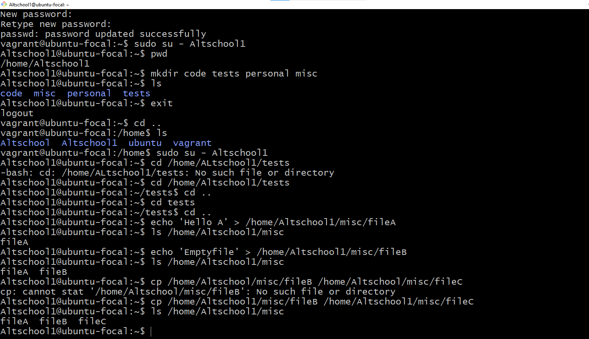
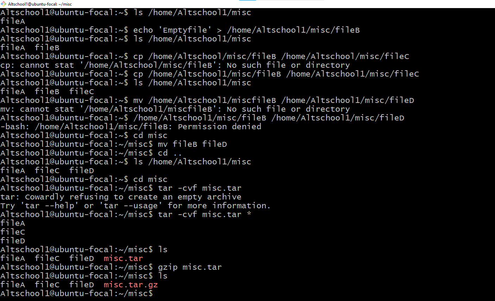

# Answer

1. ## Login Name(Altschool)

This image depicts me setting up a user called Altschool and loggin into the user

2. ## Relative pathname

3. ## Absolute pathname

4. ## create file with echo

5. ## create empty fileB

6. ## copy fileA into fileC

7. ## move fileB to fileD

8. ## create tar archive

9. ## compress the tar archive 

10. ## create a user and force user to change password

user created

user required to change password

11. ## Lock a users password

12. ## user with no login shell

13. ## Disable password based authentication for ssh

14. ## Disable root login
